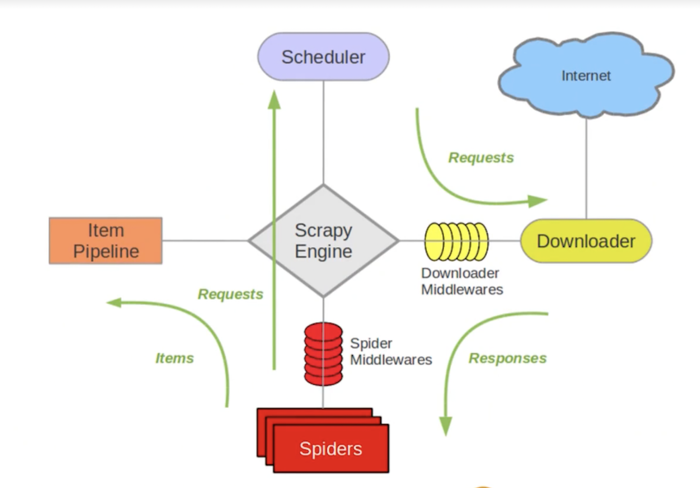

学习笔记
## 一、用 requests 写一个简单的爬虫
### print 
  - python 的 print 字符串前面加f表示格式化字符串，加f后可以在字符串里面使用用花括号括起来的变量和表达式，如果字符串里面没有表达式，那么前面加不加f输出应该都一样
### requests 模块
  - 需要 install requests 模块
  - request.get #模范浏览器访问 web 网站
  - eg.
    ```
    Requests is an HTTP library, written in Python, for human beings.
    Basic GET usage:

    >>> import requests
    >>> r = requests.get('https://www.python.org')
    >>> r.status_code
    200
    >>> b'Python is a programming language' in r.content
    True
    ```
## 二、获取 response 的内容
  - response.text

## 三、使用 beautifulsoup 解析爬取到的网页
### bs4 官网：https://www.crummy.com/software/BeautifulSoup/bs4/doc.zh/
  - from bs4 import BeautifulSoup as bs
  - 解析网页
    - bs_info = bs(response.text, 'html.parser')
### 利用浏览器“查找”功能找到对应内容的标签
  - eg.
  ```
  for tags in bs_info.find_all('div', attrs={'class': 'movie-item-info'}):
  # 表示 div 标签的 class 属性为 movie-item-info
    for atag in tags.find_all('a',):
        # 获取电影名称
        print(atag.get('title',))
        # 获取电影链接
        print('https://maoyan.com'+atag.get('href'))
  ```

## 四、使用 XPath 解析网页
### 获取 XPath
  - 需要 pip3 install lxml
    - import lxml.etree
  - 打开调试页面，选择指针，鼠标右键可以选择复制 XPath，另外可以在调试页面利用搜索快捷键检查获取到的 XPath 对不对
  eg.
    - my_url = 'https://maoyan.com/board/4'
### 请求返回
  - response = requests.get(my_url,headers=header)
### 使用 bs 解析 html 网页
  - bs_info = bs(response.text, 'html.parser')
### http 返回码
  - print(f'返回码是：{response.status_code}')
### xml 化处理
  - selector = lxml.etree.HTML(response.text)
### 电影名称
  - file_name = selector.xpath('//*[@id="app"]/div/div/div[1]/dl/dd[1]/div/div/div[1]/p[1]/a/text()')
## 五、利用 pandas 保存数据
  - 需要 pip3 install pandas
    - import pandas as pd
  - eg.
### 构造数据格式
  - data_list = [file_name, plan_date]
   - movie_maoyan = pd.DataFrame(data = data_list)
### 写入本地文件
  - movie_maoyan.to_csv('./movie_douban.csv, encoding=utf-8, index=False, header=False')

## 六、实现爬虫的自动翻页功能
  - eg.
  ```
  urls = tuple(f'https://movie.douban.com/top250?start={ page * 25 }&filter=' for page in range(10))
  ```

## 七、Python 基础语法
  - Python 简介： https://docs.python.org/zh-cn/3.7/tutorial/introduction.html
  - Python 数据结构： https://docs.python.org/zh-cn/3.7/tutorial/datastructures.html
  - Python 其他流程控制工具 : https://docs.python.org/zh-cn/3.7/tutorial/controlflow.html
  - Python 中的类： https://docs.python.org/zh-cn/3.7/tutorial/classes.html
  - Python 定义函数： https://docs.python.org/zh-cn/3.7/tutorial/controlflow.html#defining-functions

## 八、html 基本结构
  - w3c 标准官方文档：https://www.w3.org/standards/

## 九、scrapy 架构官方文档介绍
  - Scrapy 架构官方文档介绍： https://docs.scrapy.org/en/latest/topics/architecture.html
  
  - 核心组件
  
  - 工作流程
  
    - 引擎是整个爬虫最开始运行的部分，根据 spiders 指定的域名发给 scheduler（有去重功能），发送给 downloader（类似 requests），回送到引擎中，交个 spiders，一个方向到 items，通过 pipline 进行保存到数据库或者本地文件，另一个方向到引擎再到 scheduler

## 十、scrapy 爬虫目录结构解析
  - 安装 pip3 install scrapy
  - 创建项目：
    - scrapy startproject project_name
    - scrapy genspider example example.com
  - scrapy 目录结构：
  
  - 运行
    - scrapy crawl spider_name

## 十一、XPath 详解
  - // 表示可匹配任意长度，eg. //div[@class="hd"] 表示寻找 div 标签中 class 属性值为 hd
  - / 表示匹配到的第一个符合条件的
  - . 表示从当前的匹配位置开始找
  - .. 表示从当前位置的上一层查找
  - 取内容 eg. './a/span/text()' 表示当前位置的 a 标签下的 span 标签的值
  - 取属性 eg. './a/@href' 表示当前位置的 a 标签的 href 属性
### 官方文档
  - Scrapy Xpath 官方学习文档： https://docs.scrapy.org/en/latest/topics/selectors.html#working-with-xpaths
  - Xpath 中文文档：https://www.w3school.com.cn/xpath/index.asp
  - Xpath 英文文档：https://www.w3.org/TR/2017/REC-xpath-31-20170321/#nt-bnf