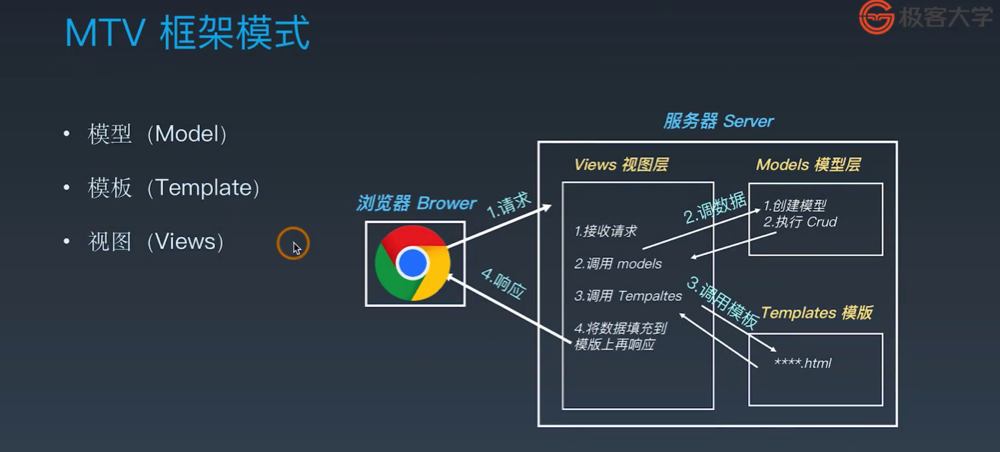
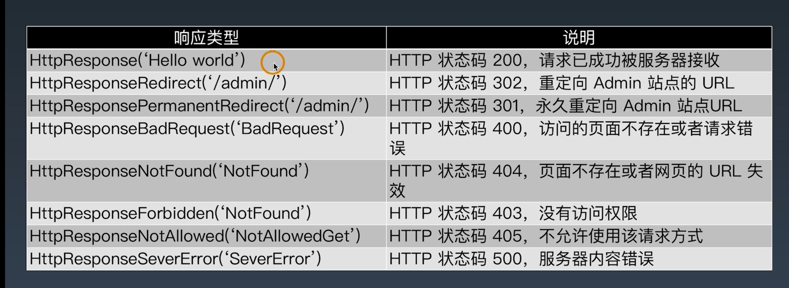

## 一、开发环境配置
1. [Django 官方文档](https://docs.djangoproject.com/zh-hans/3.0/)
2. MTV 框架模式 

3. Django 的特点
  - 采用了 MTV 的框架
  - 强调快速开发和代码修复 DRY（Do not repeat yourself）
  - 组件丰富：
    - ORM（对象关系映射）映射类来构建数据模型
    - URL 支持正则表达式
    - 模板可继承
    - 内置用户认证，提供用户认证和权限功能
    - admin 管理系统
    - 内置表单模型、Cache 缓存系统、国际化系统等
4. 安装：pip install --upgrade django==2.2.13 (LTS 表示长期支持)
## 二、创建项目和目录结构
1. 创建 Django 项目
  - $ django-admin startproject MyDjango
  - 目录结构如下：
    - $ find MyDjango/
      - MyDjango/
      - MyDjango/manage.py --- 项目管理文件，命令行工具
      - MyDjango/MyDjango
      - MyDjango/MyDjango/__init__.py
      - MyDjango/MyDjango/settings.py --- 项目的配置文件
      - MyDjango/MyDjango/urls.py
      - MyDjango/MyDjango/wsgi.py
2. 创建 Django 应用程序
  - $ python manage.py help --- 查看该工具的具体功能
  - $ python manage.py startapp index
    - index/migrations --- 数据库迁移文件夹
    - index/models.py --- 模型
    - index/apps.py --- 当前 app 配置文件
    - index/admin.py --- 管理后台
    - index/tests.py --- 自动化测试
    - index/views.py --- 视图
3. 启动和停止 Django 应用程序
  - $ python manage.py runserver --- 默认是 127.0.0.1:8000
  - $ python manage.py runserver 0.0.0.0:80
## 三、解析 settings.py 主要配置文件
1. 配置文件包括 settings.py ：
  - 项目路径
  - 密钥
  - 域名访问控制
  - App 列表
  - 静态资源，包括 CSS、JavaScript 图片等
  - 模板文件
  - 数据库配置
  - 缓存
  - 中间件
2. settings.py 配置文件示例代码
```
# 不要去改变这个列表的顺序，这是 django执行各个 app 的顺序，自己创建的 app 手动添加进去，比如 index 这个 app

INSTALLED_APPS = [
    ####  内置的后台管理系统
    'django.contrib.admin',
    ####  内置的用户认证系统
    'django.contrib.auth',
    #### 所有model元数据
    'django.contrib.contenttypes',
    #### 会话，表示当前访问网站的用户身份
    'django.contrib.sessions',
    #### 消息提示
    'django.contrib.messages',
    #### 静态资源路径
    'django.contrib.staticfiles',
    #### 注册自己的APP
    'index',
]
#### 中间件是request和response对象之间的钩子
MIDDLEWARE = [
    'django.middleware.security.SecurityMiddleware',
    'django.contrib.sessions.middleware.SessionMiddleware',
    'django.middleware.common.CommonMiddleware',
    'django.middleware.csrf.CsrfViewMiddleware',
    'django.contrib.auth.middleware.AuthenticationMiddleware',
    'django.contrib.messages.middleware.MessageMiddleware',
    'django.middleware.clickjacking.XFrameOptionsMiddleware',
]

# urlconfig 的缩写，一个 http 的请求，Django 利用哪个文件对 url 进行匹配，默认使用 urls.py
ROOT_URLCONF = 'MyDjango.urls'

TEMPLATES = [
    {
        #### 定义模板引擎
        'BACKEND': 'django.template.backends.django.DjangoTemplates',
        #### 设置模板路径，一般不在这里设置模板路径，而是放在 app 中
        'DIRS': [],
        #### 是否在App里查找模板文件
        'APP_DIRS': True,
        #### 用于RequestContext上下文的调用函数
        'OPTIONS': {
            'context_processors': [
                'django.template.context_processors.debug',
                'django.template.context_processors.request',
                'django.contrib.auth.context_processors.auth',
                'django.contrib.messages.context_processors.messages',
            ],
        },
    },
]

# Database
# https://docs.djangoproject.com/en/2.2/ref/settings/#databases
#### 数据库配置，默认是sqlite，Django2.2使用mysqlclient或pymysql模块连接MySQL
# DATABASES = {
#     'default': {
#         'ENGINE': 'django.db.backends.sqlite3',
#         'NAME': os.path.join(BASE_DIR, 'db.sqlite3'),
#     }
# }

# export PATH=$PATH:/usr/local/mysql/bin
# OSError: mysql_config not found
# pip install mysqlclient
# pip install pymysql
DATABASES = {
    'default': {
        # 加载数据库的引擎
        'ENGINE': 'django.db.backends.mysql',
        # 库名
        'NAME': 'test',
        'USER': 'root',
        'PASSWORD': 'rootroot',
        'HOST': '127.0.0.1',
        'PORT': '3306',
    }
    # 生产环境有可能连接第二个数据库
    # 'db2': {
    #     'ENGINE': 'django.db.backends.mysql',
    #     'NAME': 'mydatabase',
    #     'USER': 'mydatabaseuser',
    #     'PASSWORD': 'mypassword',
    #     'HOST': '127.0.0.1',
    #     'PORT': '3307',
    # }
}

# Password validation
# https://docs.djangoproject.com/en/2.2/ref/settings/#auth-password-validators

AUTH_PASSWORD_VALIDATORS = [
    {
        'NAME': 'django.contrib.auth.password_validation.UserAttributeSimilarityValidator',
    },
    {
        'NAME': 'django.contrib.auth.password_validation.MinimumLengthValidator',
    },
    {
        'NAME': 'django.contrib.auth.password_validation.CommonPasswordValidator',
    },
    {
        'NAME': 'django.contrib.auth.password_validation.NumericPasswordValidator',
    },
]

# Internationalization
# https://docs.djangoproject.com/en/2.2/topics/i18n/

LANGUAGE_CODE = 'en-us'
TIME_ZONE = 'UTC'
USE_I18N = True
USE_L10N = True
USE_TZ = True

# Static files (CSS, JavaScript, Images)
# https://docs.djangoproject.com/en/2.2/howto/static-files/

STATIC_URL = '/static/'
```
## 四、urls 调度器
### Django 如何处理一个请求
#### 当一个用户请求 Django 站点的一个页面：
1. 如果传入 HttpRequest 对象拥有 urlconf 属性（ 通过中间件设置），它的值将被用来代替 ROOT_URLCONF 设置
2. Django 加载 URLCONF 模块并寻找可用的 urlpatterns，Django 依次匹配每个 URL 模式，在与请求的 URL 匹配的第一个模式停下来
3. 一旦有 URL 匹配成功，Django 导入并调用相关的视图，视图会获得如下参数：
  - 一个HttpRequest实例
  - 一个或多个位置参数提供
4. 如果没有 URL 被匹配，或者匹配过程中出现了异常，Django 会调用一个适当的错误处理视图
5. 代码示例：增加项目 urls
```
from django.contrib import admin
from django.urls import path,incloud

urlpatterns = [
  path('admin/', admin.site.urls),
  # 请求 url 是空，找到 index 这个 app 下的 urls 文件
  path('', incloud('index.urls')),
]
```
6. 代码示例：增加 index 的 urls
```
# index/urls.py
from django.urls import path
from . import views

urlpatterns = [
  path('', views.index)
]

# index/views.py
from django.shortcuts import render
from django.http import HttpResponse

def index(request):
    return HttpResponse("Hello Django!")
```
7. 请求流程（url 调度器工作流程）： 请求 --> 配置文件（setting.py 中的 "ROOT_URLCONF = 'MyDjango.urls'" 配置项）--> 应用程序（app）的 urls 文件 --> view 视图处理 --> 返回
## 五、模块和包
1. 模块：.py 结尾的 python 程序
2. 包：存放多个模块的目录
3. __init__.py 包执行的初始化文件，可以是空文件
4. 常见的几种导入方式：
  - import
  - from ... import ...
  - from ... import ... as ...
    - 引入同目录的模块：from . import M1
    - 引入同目录下包的模块： from .Pkg2 import M2
5. import 的时候，默认路径是 python 的安装路径下的 site-packages 里边找
## 六、让 URL 支持变量
1. 带变量的 URL
  - str
  - int
  - slug --- 备注
  - uuid 
  - path
    - path('<int:year>', views.myyear)
```
urls.py

urlpatterns = [
    path('', views.index),

    ### 带变量的URL
    # path('<int:year>', views.year),  # 只接收整数，其他类型返回404
    path('<int:year>/<str:name>', views.name),

    ### 正则匹配
    re_path('(?P<year>[0-9]{4}).html', views.myyear, name='urlyear'),

    ### 自定义过滤器
    path('<yyyy:year>', views.year), 

]
###############

views.py

def index(request):
    return HttpResponse("Hello Django!")

# path('<int:year>', views.year), 
def year(request, year):
    # return HttpResponse(year)
    return redirect('/2020.html')

# path('<int:year>/<str:name>', views.name),
def name(request, **kwargs):
    return HttpResponse(kwargs['name'])

# path('<myint:year>', views.year), 
# re_path('(?P<year>[0-9]{4}).html', views.myyear, name='urlyear'),
def myyear(request, year):
    return render(request, 'yearview.html')
```
## 七、URL 正则和自定义过滤器
1. 需要 import re_path，代码示例：
```
urls.py

### 正则匹配
urlpatterns = [
    # ?P 是固定写法，<year> 表示变量
    re_path('(?P<year>[0-9]{4}).html', views.myyear, name='urlyear'),
]
############

views.py

def myyear(request, year):
    return render(request, 'yearview.html')
############

Templates 文件夹增加 yearview.html
<html>
<head>
    <meta charset="UTF-8">
    <title>Title</title>
</head>
<body>
<div><a href="/2020.html">2020 booklist</a></div>
<div><a href="">2020 booklist</a></div>
</body>
```
2. 自定义过滤器
```
# 需要导入正则：re_path，导入过滤器：register_converter
# urls.py

from django.urls import path, re_path, register_converter
from . import views, converters

register_converter(converters.IntConverter,'myint')
register_converter(converters.FourDigitYearConverter, 'yyyy')

urlpatterns = [
    path('', views.index),

    ### 带变量的URL
    # path('<int:year>', views.year),  # 只接收整数，其他类型返回404
    path('<int:year>/<str:name>', views.name),

    ### 正则匹配
    re_path('(?P<year>[0-9]{4}).html', views.myyear, name='urlyear'),

    ### 自定义过滤器
    path('<yyyy:year>', views.year), 

]
```
```
# converters.py

class IntConverter:
    regex = '[0-9]+'

    def to_python(self, value):
        return int(value)

    def to_url(self, value):
        return str(value)

class FourDigitYearConverter:
    regex = '[0-9]{4}'

    def to_python(self, value):
        return int(value)

    def to_url(self, value):
        return '%04d' % value
```
## 八、view 视图快捷方式
1. response 返回

### Django 快捷函数
1. render()
  - 将给定的模板与给定的上下文字典组合在一起，并以渲染的文本返回一个 HttpResponse 对象
  - 将返回的内容写入到一个文件当中，直接返回
  - 代码示例
```
def myyear(request, year):
    # 接收请求 request，在 templates 中存在 yearview.html 文件
    return render(request, 'yearview.html')
```
2. redirect()
  - 将一个 HttpResponse 返回到传递的参数的适当的 URL
  - 代码示例
```
def year(request, year):
    # return HttpResponse(year)，处理完相应的请求之后转到另外一个 url 中
    return redirect('/2020.html')
```
3. get_object_or_404()
  - 在给定的模型管理器（model manager）上调用 get()，但他会引发 Http404 而不是模型的 DoesNotExist 异常
## 使用 orm 创建数据表
### 模型与数据库
1. 每个模型都是一个 python 的类，这些类继承 django.db.models.Model
2. 模型类的每个属性都相当于一个数据库的字段
3. 利用这些，Django 提供了一个自动生成访问数据库的 API
4. 代码示例
```
from django.db import models

# 定义一个 Proson 表
class Person(models.Model):
  # 指定字段类型，Integer，primary_key 定义主键
  id = models.IntegerField(primary_key=True)
  first_name = models.CharField(max_length=30)
  last_name = models.CharField(max_length=30)

# 表明是应用程序名称+person
CREATE TABLE myapp_person(
  "id" serial NOT NULL PRIMART KEY,
  "first_name" varchar(30) NOT NULL,
  "last_name" varchar(30) NOT NULL
);

# 转化成 sql
$ python manage.py makemigrations
$ python manage.py migrate
```
```
models.py

from django.db import models

# Create your models here.
# 图书or电影
class Type(models.Model):
    # id = models.AutoField(primary_key=True)  # Django会自动创建,并设置为主键
    typename = models.CharField(max_length=20)

# 作品名称和作者(主演)
class Name(models.Model):
    # id 自动创建
    name = models.CharField(max_length=50)
    author = models.CharField(max_length=50)
    stars = models.CharField(max_length=10)
```
5. 防止执行 orm 报错，修改 project 中的 __init__.py
```
import pymysql
pymysql.install_as_MySQLdb()
```
6. version = Database.version_info
```
# if version < (1, 3, 13):
# raise ImproperlyConfigured('mysqlclient 1.3.13 or newer is required; you have %s.' % Database.__version__)
```
7. AttributeError: 'str' object has no attribute 'decode'
```
出现这个错误之后可以根据错误提示找到文件位置，打开 operations.py 文件，找到以下代码：
def last_executed_query(self, cursor, sql, params):
    query = getattr(cursor, '_executed', None)
    # if query is not None:
    #     query = query.decode(errors='replace')
    return query
```
## 十、ORM API
1. 使用 orm 的 shell 调试功能
  - python manage.py shell
```
from index.models import *
# 实例化
n = Name()
n.name='红楼梦'
n.author='曹雪芹'
n.stars=9.6
n.save()
```
2. 使用 orm 框架 api 实现
```
from index.models import *

# insert into Name(name, author, stars) values('红楼梦', '曹雪芹', 9.6)
Name.objects.create(name='红楼梦', author='曹雪芹', stars='9.6')

# select name from Name where id=2;
Name.objects.get(id=2).name

# update Name set name='石头记' where id=2;
Name.objects.filter(name='红楼梦').update(name='石头记')

# delete from Name where id=2;
Name.objects.filter(id=2).delete()

# select name from Name;
Name.objects.values_list('name')

# select count(name) from Name;
Name.objects.values_list('name').count()
```
## 十一、Django 模板开发
1. 模板变量 {{ variables }}
2. 从 URL 获取模板变量 
3. 读取静态资源内容 
4. for 遍历标签  
5. if 判断标签  
## 十二、展示数据库中的内容
1. urls.py
```
# project urls.py
urlpatterns = [
    path('admin/', admin.site.urls),
    path('',include('index.urls')),
]

# app urls.py
urlpatterns = [
    path('', views.index),
    path('books', views.books),
]
```
2. views.py
```
from .models import Name

def books(request):
    ###  从models取数据传给template  ###
    n = Name.objects.all()
    # locals() 表示本地所有变量，包括 n
    return render(request, 'bookslist.html', locals())
```
3. models.py
```
from django.db import models

# Create your models here.
# 图书or电影
class Type(models.Model):
    # id = models.AutoField(primary_key=True)  # Django会自动创建,并设置为主键
    typename = models.CharField(max_length=20)

# 作品名称和作者(主演)
class Name(models.Model):
    # id 自动创建
    name = models.CharField(max_length=50)
    author = models.CharField(max_length=50)
    stars = models.CharField(max_length=5)
```
4. templates.booklist.html
```
<html>
<head>
    <meta charset="UTF-8">
    <title>BooksList</title>
</head>
<body>


    <div>bookname: {{ book.name }}   <br>
           author: {{ book.author }} <br>
           stars:  {{ book.stars }}  
    </div>

</body>
```
## 十三、urlconf 与 models 配置
1. orm 反向读取数据：python manage.py inspectdb > models.py
```
# 元数据，不属于任何一个字段的数据
class Meta:
    # managed = False 表示不能通过 orm 映射到数据库
    managed = False
    db_table = 't1'
```