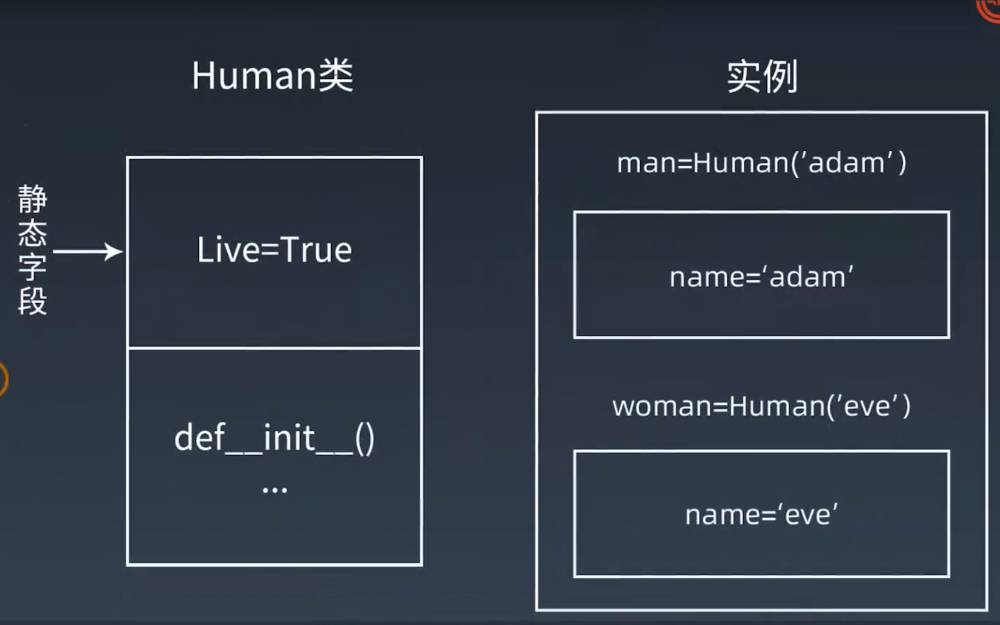
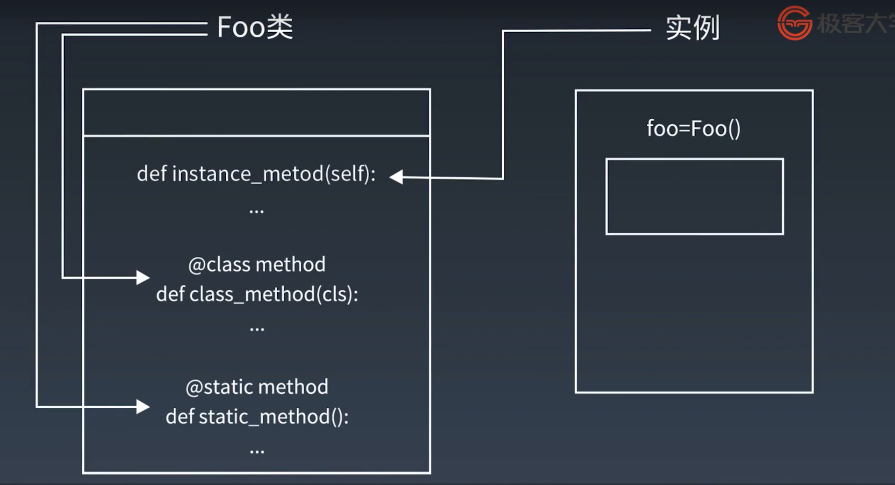
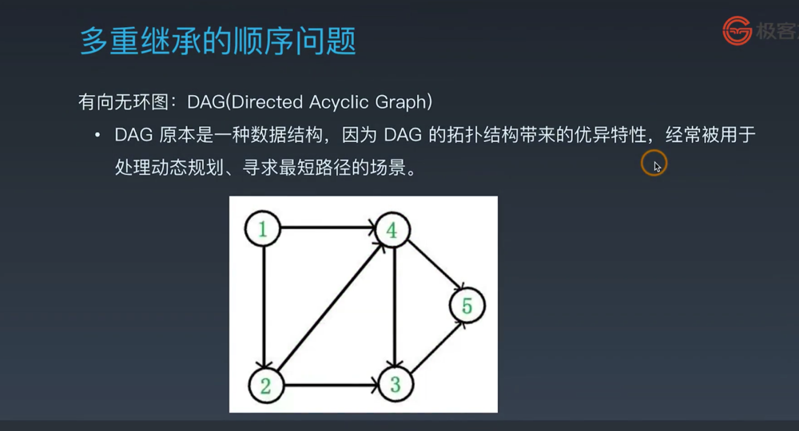

## 类属性与对象属性
### 一、面向对象编程
1. 现实世界的对象和 Python 世界的对象
2. 对象是一个数据以及相关行为的组合
3. Python 的经典类与新式类
4. 类的两大成员：属性和方法
   - 4.1 属性
      - 类属性与对象属性
      - 类属性字段在内存中只保存一份
      - 对象属性在每个对象都保存一份
      
   - 4.2 代码示例
```
# GOD
class Human(object):
    # 静态字段
    live = True

    def __init__(self, name):
        # 普通字段
        self.name = name

man = Human('Adam')
woman = Human('Eve')

# 有静态字段,live属性
Human.__dict__
# 有普通字段,name属性
man.__dict__

# 实例可以使用普通字段也可以使用静态字段
man.name
man.live = False
# 查看实例属性
man.__dict__ #普通字段有live变量
man.live
woman.live

# 类可以使用静态字段
Human.live

# 可以为类添加静态字段
Human.newattr = 1

# 查看类的属性
dir(Human)
Human.__dict__

# 内置类型不能增加属性和方法
setattr(list, 'newattr', 'value')
# TypeError

# 显示object类的所有子类
print( ().__class__.__bases__[0].__subclasses__() )
```
### 二、类的属性作用域
1. L E G B
2. 特殊作用域
```
class Human2(object):
    # 人为约定不可修改
    _age = 0

    # 私有属性
    __fly = False

    # 魔术方法，不会自动改名
    # 如 __init__

# 自动改名机制
Human2.__dict__
```
### 三、类方法描述器
1. 方法
   - 1.1 三种方法
   - 普通方法：至少一个 self 参数，表示该方法的对象
   - 类方法：至少一个 cls 参数，表示该方法的类
```
# 让实例的方法成为类的方法
class Kls1(object):
    bar = 1
    def foo(self):
        print('in foo')
    # 使用类属性、方法
    @classmethod
    def class_foo(cls):
        print(cls.bar)
        print(cls.__name__)
        cls().foo()

Kls1.class_foo()
```
```
class Story(object):
    snake = 'Python'
    def __init__(self, name):
        self.name = name
    # 类的方法
    @classmethod
    def get_apple_to_eve(cls):
        return cls.snake

s = Story('anyone')
# get_apple_to_eve 是bound方法，实例查找顺序是先找s的__dict__是否有get_apple_to_eve,如果没有，查类Story
print(s.get_apple_to_eve)
# 类和实例都可以使用
print(s.get_apple_to_eve())
print(Story.get_apple_to_eve())
# print(type(s).__dict__['get_apple_to_eve'].__get__(s,type(s)))
# print(type(s).__dict__['get_apple_to_eve'].__get__(s,type(s)) == s.get_apple_to_eve)
```
```
class Kls2():
    def __init__(self, fname, lname):
        self.fname = fname
        self.lname = lname
    
    def print_name(self):
        print(f'first name is {self.fname}')
        print(f'last name is {self.lname}')

me = Kls2('wilson','yin')
me.print_name()

# 输入改为  wilson-yin

解决方法1: 修改 __init__()
解决方法2: 增加 __new__() 构造函数
解决方法3: 增加 提前处理的函数

def pre_name(obj,name):
    fname, lname = name.split('-')
    return obj(fname, lname)

me2 = pre_name(Kls2, 'wilson-yin')
me2.print_name()
```
   - 静态方法：由类调用，无参数
   #### 三种方法在内存中都归属于类
   
2. 使用场景：
   - 定义到父类当中，使用子类的时候，子类需要根据需要自定义变量值
```
class Fruit(object):
    total = 0

    @classmethod
    def print_total(cls):
        print(cls.total)
        print(id(Fruit.total))
        print(id(cls.total))

    @classmethod
    def set(cls, value):
        print(f'calling {cls} ,{value}')
        cls.total = value

class Apple(Fruit):
    pass

class Orange(Fruit):
    pass

Apple.set(100)
# calling <class '__main__.Apple'> ,100
Orange.set(200)
# calling <class '__main__.Orange'> ,200
org=Orange()
org.set(300)
# calling <class '__main__.Orange'> ,300
Apple.print_total()
# 100
# 140735711069824
# 140735711073024
Orange.print_total() 
```
   - 类中的方法需要调用类，返回给类的时候
```
class Kls3():
    def __init__(self, fname, lname):
        self.fname = fname
        self.lname = lname
    
    @classmethod
    def pre_name(cls,name):
        fname, lname = name.split('-')
        return cls(fname, lname)
    
    def print_name(self):
        print(f'first name is {self.fname}')
        print(f'last name is {self.lname}')

me3 = Kls3.pre_name('wilson-yin')
me3.print_name()
```
### 四、静态方法描述器
1. 功能的转化、增加判断用到 staticmethod
```
import datetime
class Story(object):
    snake = 'Python'
    def __init__(self, name):
        self.name = name
    # 静态的方法
    @staticmethod
    def god_come_go():
        if datetime.datetime.now().month % 2 :
             print('god is coming')
    
Story.god_come_go()

# 静态方法可以由类直接调用
# 因为不传入self 也不传入 cls ，所以不能使用类属性和实例属性
```
### 五、描述器高级应用 __getattribute__
1. 属性的处理
   - 在类中，需要对实例获取属性这一行为进行操作，可以使用：
      - __getattribute__()
      - __getattr__()
   - 异同：
      - 都可以对实例属性进行获取拦截
      - __getattr__() 适用于未定义的属性
      - __getattribute__() 对所有属性的访问都会调用该方法
2. __getattribute__ 代码示例
```
# GOD
class Human(object):  
    # 接收参数  
    def __init__(self, name):
        self.name = name

h1 = Human('Adam')
h2 = Human('Eve')

# 对实例属性做修改
h1.name = 'python'

# 对实例属性查询
h1.name

# 删除实例属性
del h1.name

# AttributeError，访问不存在的属性
# 由__getattribute__(self,name)抛出
h1.name

###################
class Human2(object):  
    """
    getattribute对任意读取的属性进行截获
    """  
    def __init__(self):
        self.age = 18
    def __getattribute__(self,item):
        print(f' __getattribute__ called item:{item}')

h1 = Human2()

h1.age
h1.noattr
```
```
class Human2(object):  
    """
    拦截已存在的属性
    """  
    def __init__(self):
        self.age = 18
    def __getattribute__(self,item):
        print(f' __getattribute__ called item:{item}')
        return super().__getattribute__(item)
h1 = Human2()

print(h1.age)
# 存在的属性返回取值
print(h1.noattr)
# 不存在的属性返回 AttributeError
```
```
class Human2(object):    
    def __getattribute__(self, item):
        """
        将不存在的属性设置为100并返回,模拟getattr行为
        """
        print('Human2:__getattribute__')
        try:
            return super().__getattribute__(item)
        except Exception as e:
            self.__dict__[item] = 100
            return 100
h1 = Human2()

print(h1.noattr)
```
### 六、描述器高级应用__getattr__
1. 代码示例
```
class Human2(object):  
    """
    属性不在实例的__dict__中,__getattr__被调用
    """
    def __init__(self):
        self.age = 18

    def __getattr__(self, item): 
        print(f' __getattr__ called item:{item}')
        # 不存在的属性返回默认值 'OK'
        return 'OK'

h1 = Human2()

print(h1.age)
print(h1.noattr)
```
```
class Human2(object):  
    def __init__(self):
        self.age = 18

    def __getattr__(self, item): 
        # 对指定属性做处理:fly属性返回'superman',其他属性返回None
        self.item = item
        if self.item == 'fly':
            return 'superman'

h1 = Human2()

print(h1.age)
print(h1.fly)
print(h1.noattr)
```
2. __dict__,__getattr__,__getattribute__ 执行顺序
```
class Human2(object):    
    """
    同时存在的调用顺序
    """
    def __init__(self):
        self.age = 18

    def __getattr__(self, item): 

        print('Human2:__getattr__')
        return 'Err 404 ,你请求的参数不存在'

    def __getattribute__(self, item):
        print('Human2:__getattribute__')
        return super().__getattribute__(item)

h1 = Human2()

# 如果同时存在，执行顺序是 __getattribute__ > __getattr__ > __dict__
print(h1.age)
print(h1.noattr)
# 注意输出，noattr的调用顺序
```
### 七、描述器原理&属性描述符
1. 属性描述符 property
   - 描述器：实现特定协议（描述符）的类
   - property 类需要实现 __get__、__set__、__delete__ 方法
```
class Teacher:
    def __init__(self,name):
        self.name = name
    
    def __get__(self):
        return self.name

    def __set__(self):
        self.name = value

T1 = Teacher('yin') 
```
```
# __getattribute__ 的底层原理是描述器
class Desc(object):
    """
    通过打印来展示描述器的访问流程
    """
    def __init__(self, name):
        self.name = name
    
    def __get__(self, instance, owner):
        print(f'__get__{instance} {owner}')
        return self.name

    def __set__(self, instance, value):
        print(f'__set__{instance} {value}')
        self.name = value

    def __delete__(self, instance):
        print(f'__delete__{instance}')
        del self.name

class MyObj(object):
    a = Desc('aaa')
    b = Desc('bbb')

my_object = MyObj()
print(my_object.a)

my_object.a = 456
print(my_object.a)
```
2. 属性描述符的装饰器功能
```
# GOD
class Human(object):
    def __init__(self, name):
        self.name = name

    # 将方法封装成属性，只读的属性，不能进行 set
    @property
    def gender(self):
        return 'M'
    
    # 支持修改
    @gender.setter
    def gender(self, value):
        self.gender = value
    # 支持删除
    @gender.deleter
    def gender(self):
        del self.gender
   
h1 = Human('Adam')
h2 = Human('Eve')
h1.gender

# AttributeError:
h2.gender = 'F'
del h.gender2

# 另一种property写法
# gender  = property(get_, set_, del_, 'other property')

# 被装饰函数建议使用相同的函数名称
# 使用setter 并不能真正意义上实现无法写入，gender被改名为 _Article__gender

# property本质并不是函数，而是特殊类（实现了数据描述符的类）
# 如果一个对象同时定义了__get__()和__set__()方法，则称为数据描述符，
# 如果仅定义了__get__()方法，则称为非数据描述符

# property的优点：
# 1 代码更简洁，可读性、可维护性更强。
# 2 更好的管理属性的访问。
# 3 控制属性访问权限，提高数据安全性。
```
3. 应用代码示例
```
# 限制传入的类型和范围（整数，且满足18-65）
class Age(object):
    def __init__(self, default_age = 18):
        self.age_range = range(18,66)
        self.default_age = default_age
        self.data = {}

    def __get__(self, instance, owner):
        return self.data.get(instance, self.default_age)
    
    def __set__(self, isinstance, value):
        if value not in self.age_range:
            raise ValueError('must be in (18-65)')

        self.data[isinstance] = value

class Student(object):
    age = Age()

if __name__ == '__main__':
    s1 = Student()
    s1.age = 30
    s1.age = 100
```
```
from sqlalchemy import Column, Integer, String, Float
from flask_sqlalchemy import SQLAlchemy
from flask_login import UserMixin
from manage import db
from werkzeug.security import generate_password_hash, check_password_hash

class User(UserMixin, db.Model):
    __tablename__ = 'users'

    id = db.Column(db.Integer, primary_key=True)
    username = db.Column(db.String(32), nullable=False, unique=True)
    password_hash = db.Column(db.String(255), nullable=False)

# 使用装饰器完成password的读取和写入功能分离
    @property
    def password(self):
        return None
    
    @password.setter
    def password(self, password):
        self.password_hash = generate_password_hash(password)
    
    def verify_password(self, password):
        return check_password_hash(self.password_hash, password)
    
    def is_active(self):
        return True
```
### 八、面向对象编程-继承
1. 新式类
   - 新式类和经典类的区别
      - 当前类或者父类继承了 object 类，那么该类便是新式类，否则便是经典类
   - object 和 type 的关系
      - object 和 type 类都属于 type 类（class 'type'）
      - type 类由 type 元类自身创建的，object 类由元类 type 创建
      - object 的父类为空，没有继承任何类
      - type 的父类为 object 类（class 'object'）
2. 类的继承
   - 单一继承
```
# 父类
class People(object):
    def __init__(self):
        self.gene = 'XY'
    def walk(self):
        print('I can walk')

# 子类
class Man(People):
    def __init__(self,name):
        self.name = name
    def work(self):
        print('work hard')

class Woman(People):
    def __init__(self,name):
        self.name = name    
    def shopping(self):
        print('buy buy buy')

p1 = Man('Adam')
p2 = Woman('Eve')
```
   - 多重继承
```
# 钻石继承
class BaseClass(object):
    num_base_calls = 0
    def call_me(self):
        print ("Calling method on Base Class")
        self.num_base_calls += 1

class LeftSubclass(BaseClass):
    num_left_calls = 0
    def call_me(self):
        print ("Calling method on Left Subclass")
        self.num_left_calls += 1

class RightSubclass(BaseClass):
    num_right_calls = 0
    def call_me(self):
        print("Calling method on Right Subclass")
        self.num_right_calls += 1

class Subclass(LeftSubclass,RightSubclass):
    pass

a = Subclass()
a.call_me()

print(Subclass.mro())
# 广度优先， 另外Python3 中不加(object)也是新式类，但是为了代码不会误运行在python2下产生意外结果，仍然建议增加
# >>> Subclass.mro()
# [<class '__main__.Subclass'>, <class '__main__.LeftSubclass'>, <class '__main__.RightSubclass'>, <class '__main__.BaseClass'>, <class 'object'>]

#  修改RightSubclass 的 父类为 Object
# >>> Subclass.mro()
# [<class '__main__.Subclass'>, <class '__main__.LeftSubclass'>, <class '__main__.BaseClass'>, <class '__main__.RightSubclass'>, <class 'object'>]
```
   - 菱形继承（钻石继承）
      - 1 表示入度为 0，没有类继承 1
   
   - 继承机制 MRO
   - MRO 的 C3 算法
### 九、solid设计原则与设计模式&单例模式
1. soild 设计原则
   - 单一责任原则 The Single Responsibility Principle
   - 开发封闭原则 The Open Closed Principle
   - 里式替换原则 The Liskov Substitution Principle
   - 依赖倒置原则 The Dependency Inversion Principle
   - 接口分离原则 The Interface Segregation Principle
2. 设计模式
   - 2.1 单例模式 
      - 对象只存在一个实例
      - __init__ 和 __new__ 的区别：
         - __new__ 是实例创建之前被调用，返回该实例对象，是静态方法
         - __init__ 是实例对象传建完成后被调用，是实例方法
         - __new__ 先被调用，__init__ 后背调用
         - __new__ 的返回值（实例）将传递给 __init__ 方法的第一个参数，__init__ 给这个实例设置相关参数
```
# 装饰器实现单实例模式
def singleton(cls):
    instances = {}
    def getinstance():
        if cls not in instances:
            instances[cls] = cls()
        return instances[cls]
    return getinstance

@singleton 
class MyClass:
    pass

m1 = MyClass()
m2 = MyClass()
print(id(m1))
print(id(m2))
```
```
# __new__ 与 __init__ 的关系
class Foo(object):
    def __new__(cls, name):
        print('trace __new__')
        return super().__new__(cls)
    
    def __init__(self, name):
        print('trace __init__')
        super().__init__()
        self.name = name

bar = Foo('test')
bar.name
```
### 十、工厂模式
1. 静态工厂代码示例
```
class Human(object):
    def __init__(self):
        self.name = None
        self.gender = None

    def getName(self):
        return self.name

    def getGender(self):
        return self.gender

class Man(Human):
    def __init__(self, name):
        print(f'Hi,man {name}')

class Woman(Human):
    def __init__(self, name):
        print(f'Hi,woman {name}')

class Factory:
    def getPerson(self, name, gender):
        if gender == 'M':
            return Man(name)
        elif gender == 'F':
            return Woman(name)
        else:
            pass

if __name__ == '__main__':
    factory = Factory()
    person = factory.getPerson("Adam", "M")
```
 2. 类工厂代码示例
 ```
# 返回在函数内动态创建的类
def factory2(func):
    class klass: pass
    #setattr需要三个参数:对象、key、value
    setattr(klass, func.__name__, func)
    return klass

def say_foo(self): 
    print('bar')

Foo = factory2(say_foo)
foo = Foo()
foo.say_foo()
 ```
### 十一、元类
1. 元类是创建类的类，是类的模板
2. 元类是用来控制如何创先类的，正如类是创建对象的模板一样
3. 元类的实例为类，正如类的实力为对象
4. 创建元类的两种方法
   - class
   - type
      - type（类名，父类的元组，包含属性的字典）
5. 使用 type 元类创建类代码示例
```
def hi():
    print('Hi metaclass')

# type的三个参数:类名、父类的元组、类的成员
Foo = type('Foo',(),{'say_hi':hi})
foo = Foo
foo.say_hi()
# 元类type首先是一个类，所以比类工厂的方法更灵活多变，可以自由创建子类来扩展元类的能力
```
```
def pop_value(self,dict_value):
    for key in self.keys():
        if self.__getitem__(key) == dict_value:
            self.pop(key)
            break

# 元类要求,必须继承自type    
class DelValue(type):
    # 元类要求，必须实现new方法
    def __new__(cls,name,bases,attrs):
        attrs['pop_value'] = pop_value
        return type.__new__(cls,name,bases,attrs)
 
class DelDictValue(dict,metaclass=DelValue):
    # python2的用法，在python3不支持
    # __metaclass__ = DelValue
    # metaclass 表示声明元类是谁
    pass

d = DelDictValue()
d['a']='A'
d['b']='B'
d['c']='C'
d.pop_value('C')
for k,v in d.items():
    print(k,v)
```
### 十二、mixin 模式（抽象基类）
1. 抽象基类（abstract base class，ABC）用来确保派生类实现了基类中的特定方法
2. 使用抽象基类的好处
   - 避免继承错误，使类层次易于理解和维护
   - 无法实例化基类
   - 如果忘记在其中一个子类中实现接口方法，要尽早报错
```
from abc import ABCMeta, abstractmethod
class Base(metaclass=ABCMeta):
    @abstractmethod
    def foo(self):
        pass
    @abstractmethod
    def bar(self):
        pass

class Concrete(Base):
    def foo(self):
        pass

c = Concrete() # TypeError
```
3. Mixin 模式
   - 在程序运行过程中，重定义类的继承，即动态继承，好处：
      - 可以在不修改任何源代码的情况下，对已有类进行扩展
      - 进行组件的划分
   - 代码示例
```
def mixin(Klass, MixinKlass):
    Klass.__bases__ = (MixinKlass,) + Klass.__bases__

class Fclass(object):
    def text(self):
        print('in FatherClass')

class S1class(Fclass):
    pass

class MixinClass(object):
    def text(self):
        return super().text()
        # print('in MixinClass')

class S2class(S1class, MixinClass):
    pass

print(f' test1 : S1class MRO : {S1class.mro()}')
s1 = S1class()
s1.text()

mixin(S1class, MixinClass)
print(f' test2 : S1class MRO : {S1class.mro()}')
s1 = S1class()
s1.text()

print(f' test3 : S2class MRO : {S2class.mro()}')
s2 = S2class()
s2.text()
```
```
# 《Python GUI Programming with Tkinter》
# Mixin类无法单独使用，必须和其他类混合使用，来加强其他类

class Displayer():
    def display(self, message):
        print(message)

class LoggerMixin():
    def log(self, message, filename='logfile.txt'):
        with open(filename, 'a') as fh:
            fh.write(message)

    def display(self, message):
        super(LoggerMixin, self).display(message)
        self.log(message)

class MySubClass(LoggerMixin, Displayer):
    def log(self, message):
        super().log(message, filename='subclasslog.txt')

subclass = MySubClass()
subclass.display("This string will be shown and logged in subclasslog.txt")
print(MySubClass.mro())
```