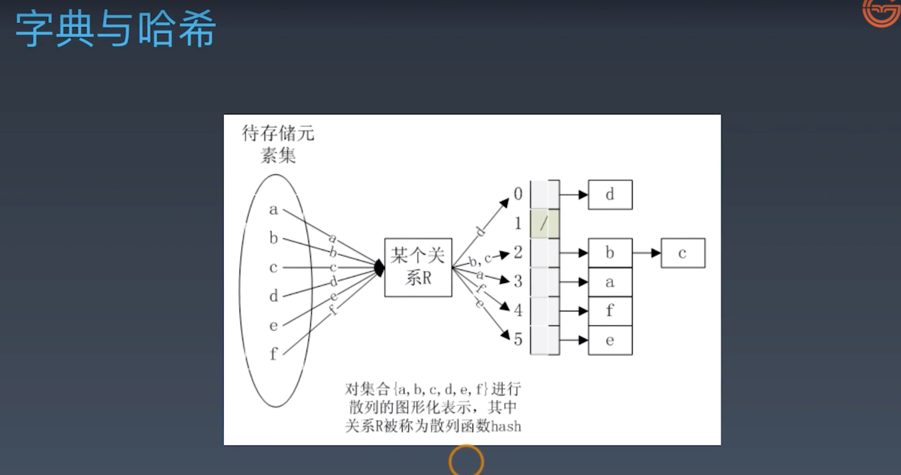

## 一、变量的赋值
1. 可变数据类型
   - 列表 list
   - 字典 dict
2. 不可变数据类型
   - 整型 int
   - 浮点型 float
   - 字符串型 string
   - 元组 tuple
3. 理解箱子与标签的关系，箱子相当于申请到的内存
4. 代码示例
```
# 问题1: a、b、c三个id是否相同
a = 123
b = 123
c = a
print(id(a))
print(id(b))
print(id(c))

#############
# 问题2: a、b、c的值分别是多少
a = 456
print(id(a))
c = 789
c = b = a

#############
# 问题3: x、y的值分别是什么
x = [1,2,3]
y = x
x.append(4)
print(x)
print(y)

#############
# 问题4: a、b的值分别是多少
a = [1, 2, 3]
b = a
a = [4, 5, 6]

#############
# 问题5: a、b的值分别是多少
a = [1, 2, 3]
b = a
a[0],a[1],a[2] = 4, 5, 6
```
## 二、容器序列的深浅拷贝
1. 序列
   - 序列分类
      - 容器序列：list、tuple、collections.deque 等，能存放不通类型的数据
      - 扁平序列：str、bytes、bytearray、memoryview（内存视图）、array.array 等，存放的是相同类型的数据，扁平序列只能容纳一种类型
   - 可变类型存在深、浅拷贝问题
      - 注意：不可变类型（数字、字符串、元组）类型没有拷贝问题
2. 深、浅拷贝
   - 深拷贝是在另一块地址中创建一个新的变量或容器，同时容器内的元素的地址也是新开辟的，仅仅是值相同而已，是完全的副本。也就是说（ 新瓶装新酒 ）
   - 浅拷贝就是对引用的拷贝，深拷贝就是对对象的资源的拷贝
   - 赋值是将一个对象的地址赋值给一个变量，让变量指向该地址（ 旧瓶装旧酒 ）
   - 修改不可变对象（str、tuple）需要开辟新的空间
   - 修改可变对象（list等）不需要开辟新的空间
```
# 容器序列的拷贝问题

old_list = [ i for i in range(1, 11)]

new_list1 = old_list
new_list2 = list(old_list)

# 切片操作
new_list3 = old_list[:]

# 嵌套对象
old_list.append([11, 12])

import copy
new_list4 = copy.copy(old_list)
new_list5 = copy.deepcopy(old_list)

assert new_list4 == new_list5 #True
assert new_list4 is new_list5 #False AssertionError

old_list[10][0] = 13
```
## 三、字典与扩展内置数据类型
1. 字典扩充

   - 字典 key 可以使用的数据类型：可哈希（不可变数据类型）
2. [collections 官网文档：](https://docs.python.org/zh-cn/3.7/library/collections.html)
   - nametuple -- 带命名的元组
```
# 命名元组
from collections import namedtuple
Point = namedtuple('Ponit', ['x','y'])
p = Point(10, y=20)
p.x + p.y
p[0] + p[1]
x, y = p
```
   - deque 双向队列
```
# 双向队列
from collections import deque
d = deque('uvw')
d.append('xyz')
d.appendleft('rst')
```
   - Counter 计数器
```
from collections import Counter
mystring = ['a','b','c','d','d','d','d','c','c','e']
# 取得频率最高的前三个值
cnt = Counter(mystring)
cnt.most_common(3)
cnt['b']
```
3. 计算欧式距离
```
import numpy as np
'''
计算欧式距离
'''
vector1 = np.array([1, 2, 3])
vector2 = np.array([4, 5, 6])

op1 = np.sqrt(np.sum(np.square(vector1-vector2)))
op2 = np.linalg.norm(vector1-vector2)

from collections import namedtuple
from math import sqrt
Point = namedtuple('Ponit', ['x','y','z'])

class Vector(Point):
    def __init__(self, p1, p2, p3):
        super(Vector).__init__()
        self.p1 = p1
        self.p2 = p2
        self.p3 = p3
    # 魔术方法，a - b，Python 内部的方法是 a.__sub__(b)，在此重构 __sub__ 方法
    def __sub__(self, other):
        tmp = (self.p1 - other.p1)**2+(self.p2 - other.p2)**2+(self.p3 - other.p3)**2
        return sqrt(tmp)

p1 = Vector(1, 2, 3)
p2 = Vector(4, 5, 6)

p1-p2
```
## 四、函数的调用
1. 只是函数名的话是传递函数对象（func），带括号的话是传递函数的返回值、函数执行的结果（func()）
```
class Kls1(object):
    def __call__(self):
        return 123

inst1 = Kls1()
inst1
inst1()
type(inst1)
type(inst1())
```
## 五、变量作用域
1. LEGB
   - L-Local(function)；函数内的名字空间
   - E-Enclosing function locals；外部嵌套函数的名字空间（例如 closure）
   - G-Global(module)；函数定义所在模块（文件）的名字空间
   - B-Builtin(python)；Python 内置模块的名字空间
```
# L G
x = 'Global'
def func2():
    x = 'Enclosing'

    def func3():
        x = 'Local'

        print(x)
    func3()
print(x)
func2()

# E
x = 'Global'
def func4():
    x = 'Enclosing'
    def func5():
        return x
    return func5

var = func4()
print(var())

# B
print (dir(__builtins__))
```
## 六、函数工具与高阶函数
1. 可变长参数 *args，**kwargs
```
def func(*args, **kargs):
    print(f'args: {args}')
    print(f'kargs:{kargs}')

func(123, 'xz', name='xvalue')
```
2. 偏函数
   - functools.partial：返回一个可调用的 partial 对象
   - 使用方法：partial(func, *args, **kw)
      - 注意：
      - func 是必须参数
      - 至少需要一个 args 或 kw 参数
3. lambda 表达式
   - lambda 只是表达式，不是所有的函数逻辑都能封装进去
   - eg：
```
k = lambda x:x+1
print(k(1))
```
   - lambda 表达式后面只能有一个表达式
   - 实现简单函数的时候可以使用 lambda 表达式替代
   - 使用高阶函数的时候一般使用 lambda 表达式
4. 高阶函数
   - 高阶：参数是函数、返回值是函数
   - 常见的高阶函数：map、reduce、filter
   - 推导式和生成器表达式可以代替 map 和 filter 函数
```
# map
def square(x):
    return x**2

m = map(square, range(10))
next(m)
list(m)
[square(x) for x in range(10)]
dir(m)

# reduce
# reduce(f, [x1, x2, x3]) = f(f(x1, x2), x3)
from functools import reduce
def add(x, y):
    return x + y

reduce(add, [1, 3, 5, 7, 9])
#25

# filter
def is_odd(n):
    return n % 2 == 1

list(filter(is_odd, [1, 2, 4, 5, 6, 9, 10, 15]))

# 偏函数
def add(x, y):
    return x + y

import functools
add_1 = functools.partial(add, 1)
add_1(10)

import itertools
g = itertools.count()
next(g)
next(g)
auto_add_1 = functools.partial(next, g)
auto_add_1()

sorted(['bob', 'about', 'Zoo', 'Credit'])
sorted(['bob', 'about', 'Zoo', 'Credit'], key=str.lower)
sorted(['bob', 'about', 'Zoo', 'Credit'], key=str.lower, reverse=True)
```
## 七、闭包
1. 返回的两个关键字：return、yield
2. 返回的对象：可调用对象--闭包（装饰器）
```
# version 1
# 函数是一个对象，所以可以作为某个函数的返回结果
def line_conf():
    def line(x):
        return 2*x+1
    return line       # return a function object

my_line = line_conf()
print(my_line(5))

# version 2
# 如果line()的定义中引用了外部的变量
def line_conf():

    b = 10
    def line(x):
        return 2*x+b
    return line       

my_line = line_conf()
print(my_line(5))

# version 3

def line_conf():
    b = 10
    def line(x):
        '''如果line()的定义中引用了外部的变量'''
        return 2*x+b
    return line       

b = -1
my_line = line_conf()
print(my_line(5))

# 编译后函数体保存的局部变量
print(my_line.__code__.co_varnames)
# 编译后函数体保存的自由变量
print(my_line.__code__.co_freevars)
# 自由变量真正的值
print(my_line.__closure__[0].cell_contents)

#####################
# 函数和对象比较有哪些不同的属性
# 函数还有哪些属性
def func(): 
    pass
func_magic = dir(func)

# 常规对象有哪些属性
class ClassA():
    pass
obj = ClassA()
obj_magic = dir(obj)

# 比较函数和对象的默认属性
set(func_magic) - set(obj_magic)

# version 4
def line_conf(a, b):
    def line(x):
        return a*x + b
    return line

line1 = line_conf(1, 1)
line2 = line_conf(4, 5)
print(line1(5), line2(5))

# version 5
# 与line绑定的是line_conf()传入的a,b
a=100
b=200
def line_conf(a, b):
    def line(x):
        return a*x+b
    return line

line1 = line_conf(1, 1)
line2 = line_conf(4, 5)
print(line1(5), line2(5))


# 内部函数对外部函数作用域里变量的引用（非全局变量）则称内部函数为闭包

def counter(start=0):
   count=[start]
   def incr():
       count[0]+=1
       return count[0]
   return incr

c1=counter(10)

print(c1())
# 结果：11
print(c1())
# 结果：12

# nonlocal访问外部函数的局部变量
# 注意start的位置，return的作用域和函数内的作用域不同
def counter2(start=0):
    def incr():
        nonlocal start
        start+=1
        return start
    return incr
c1=counter2(5)
print(c1())
print(c1())

c2=counter2(50)
print(c2())
print(c2())

print(c1())
print(c1())

print(c2())
print(c2())
```
## 八、装饰器
1. 增强而不改变原有的函数
2. 装饰器强点函数的定义台而不是运行台
```
@decorate
def target():
    print('do something')

def target():
    print('do something')
target = decorate(target)
```
```
# 包装
def html(func):
    def decorator():
        return f'<html>{func()}</html>'
    return decorator

def body(func):
    def decorator():
        return f'<body>{func()}</body>'
    return decorator

@html
@body
def content():
    return 'hello world'

content()
```
## 九、被装饰函数带参数和返回值的处理
# 被修饰函数带参数
```
def outer(func):
    def inner(a,b):
        print(f'inner: {func.__name__}')
        print(a,b)
        func(a,b)
    return inner

@outer
def foo(a,b):
    print(a+b)
    print(f'foo: {foo.__name__}')
    
    
foo(1,2)
foo.__name__

############################################

# 被修饰函数带不定长参数

def outer2(func):
    def inner2(*args,**kwargs):
        func(*args,**kwargs)
    return inner2

@outer2
def foo2(a,b,c):
    print(a+b+c)
    
foo2(1,3,5)

############################################

# 被修饰函数带返回值

def outer3(func):
    def inner3(*args,**kwargs):
        ###
        ret = func(*args,**kwargs)
        ###
        return ret
    return inner3

@outer3
def foo3(a,b,c):
    return (a+b+c)
    
print(foo3(1,3,5))

# 装饰器带参数 

def outer_arg(bar):
    def outer(func):
        def inner(*args,**kwargs):
            ret = func(*args,**kwargs)
            print(bar)
            return ret
        return inner
    return outer

# 相当于outer_arg('foo_arg')(foo)()
@outer_arg('foo_arg')
def foo(a,b,c):
    return (a+b+c)
    
print(foo(1,3,5))

############################################

# 装饰器堆叠

@classmethod
@synchronized(lock)
def foo(cls):
    pass


def foo(cls):
    pass
foo2 = synchronized(lock)(foo)
foo3 = classmethod(foo2)
foo = foo3
```
## 十、python 内置装饰器
1. wraps
```
########################
# 内置的装饰方法函数

# functools.wraps
# @wraps接受一个函数来进行装饰
# 并加入了复制函数名称、注释文档、参数列表等等的功能
# 在装饰器里面可以访问在装饰之前的函数的属性
# @functools.wraps(wrapped, assigned=WRAPPER_ASSIGNMENTS, updated=WRAPPER_UPDATES)
# 用于在定义包装器函数时发起调用 update_wrapper() 作为函数装饰器。 
# 它等价于 partial(update_wrapper, wrapped=wrapped, assigned=assigned, updated=updated)。

from time import ctime,sleep
from functools import wraps
def outer_arg(bar):
    def outer(func):
        # 结构不变增加wraps
        @wraps(func)
        def inner(*args,**kwargs):
            print("%s called at %s"%(func.__name__,ctime()))
            ret = func(*args,**kwargs)
            print(bar)
            return ret
        return inner
    return outer

@outer_arg('foo_arg')
def foo(a,b,c):
    """  __doc__  """
    return (a+b+c)
    
print(foo.__name__)

########################
# flask 使用@wraps()的案例
from functools import wraps
 
def requires_auth(func):
    @wraps(func)
    def auth_method(*args, **kwargs):
        if not auth:
            authenticate()
        return func(*args, **kwargs)
    return auth_method

@requires_auth
def func_demo():
    pass

########################

from functools import wraps
 
def logit(logfile='out.log'):
    def logging_decorator(func):
        @wraps(func)
        def wrapped_function(*args, **kwargs):
            log_string = func.__name__ + " was called"
            print(log_string)
            with open(logfile, 'a') as opened_file:
                opened_file.write(log_string + '\n')
            return func(*args, **kwargs)
        return wrapped_function
    return logging_decorator
 
@logit()
def myfunc1():
    pass
 
myfunc1()
# Output: myfunc1 was called
 
@logit(logfile='func2.log')
def myfunc2():
    pass
 
myfunc2()

# Output: myfunc2 was called

##########################
# 可以使用wrapt包替代@wraps
# # wrapt包 https://wrapt.readthedocs.io/en/latest/quick-start.html
#  @wrapt.decorator
#  def wrapper(func, instance, args, kwargs):

import wrapt

def with_arguments(myarg1, myarg2):
    @wrapt.decorator
    def wrapper(wrapped, instance, args, kwargs):
        return wrapped(*args, **kwargs)
    return wrapper

@with_arguments(1, 2)
def function():
    pass
```
2. lru_cache
```
# functools.lru_cache
# 《fluent python》的例子
# functools.lru_cache(maxsize=128, typed=False)有两个可选参数
# maxsize代表缓存的内存占用值，超过这个值之后，就的结果就会被释放
# typed若为True，则会把不同的参数类型得到的结果分开保存
import functools
@functools.lru_cache()
def fibonacci(n):
    if n < 2:
        return n
    return fibonacci(n-2) + fibonacci(n-1)

if __name__=='__main__':
    import timeit
    print(timeit.timeit("fibonacci(6)", setup="from __main__ import fibonacci"))
```
## 十一、类装饰器
```
# Python 2.6 开始添加类装饰器
from functools import wraps

class MyClass(object):
    def __init__(self, var='init_var', *args, **kwargs):
        self._v = var
        super(MyClass, self).__init__(*args, **kwargs)
    
    def __call__(self, func):
        # 类的函数装饰器
        @wraps(func)
        def wrapped_function(*args, **kwargs):
            func_name = func.__name__ + " was called"
            print(func_name)
            return func(*args, **kwargs)
        return wrapped_function

def myfunc():
    pass

MyClass(100)(myfunc)()
# 其他经常用在类装饰器的python自带装饰器
# classmethod
# staticmethod
# property

# 另一个示例
class Count(object):
    def __init__(self,func):
        self._func = func
        self.num_calls = 0
    
    def __call__(self, *args, **kargs):
        self.num_calls += 1
        print(f'num of call is {self.num_calls}')
        return self._func(*args, **kargs)

@Count
def example():
    print('hello')

example()
print(type(example))

# 其他常用的排序和计数相关用法
a = (1, 2, 3, 4)
a.sort()
# Traceback (most recent call last):
#   File "<stdin>", line 1, in <module>
# AttributeError: 'tuple' object has no attribute 'sort'
sorted(a)
# [1, 2, 3, 4]
# sorted 支持更多场景  多维list 字典混合list list混合字典

# 计数有没有更优雅、更Pythonic的解决方法呢？
# 答案是使用collections.Counter。
from collections import  Counter
Counter(some_data)
# 利用most_common()方法可以找出前N个出现频率最高的元素以及它们对应的次数
Counter(some_data).most_common(2)
```
## 十二、对象协议与鸭子类型
1. Duck Typing 的概念
   - 容器类型协议
      - __str__ 打印对象是，默认输出该方法的返回值
      - __getitem__、__setitem__、__delitem__ 字典索引操作
      - __iter__ 迭代器
      - __call__ 可调用对象协议
   - 比较大小的协议
      - __eq__
      - __gt__
   - 描述符协议和属性交互协议
      - __get__
      - __set__
   - 可哈希对象
      - __hash__
   - 上下文管理器
      - 使用 __enter__()、__exit__() 实现上下文管理器
```
class Foo(object):
    # 用与方法返回
    def __str__(self):
        return '__str__ is called'

    # 用于字典操作
    def __getitem__(self, key):
        print(f'__getitem__ {key}') 
    
    def __setitem__(self, key, value):
        print(f'__setitem__ {key}, {value}')
    
    def __delitem__(self, key):
        print(f'__delitem__ {key}')

    # 用于迭代
    def __iter__(self):
        return iter([i for i in range(5)])

# __str__
bar = Foo()
print(bar)

# __XXitem__
bar['key1']
bar['key1']='value1'
del bar['key1']

# __iter__
for i in bar:
    print(i)
```
```
import math
print('The value of Pi is approximately %5.3f.' % math.pi)

print('{1} and {0}'.format('spam', 'eggs'))

print('The story of {0}, {1}, and {other}.'.format(
    'Bill', 'Manfred', other='Georg'))

firstname = 'yin'
lastname = 'wilson'
print('Hello, %s %s.' % (lastname, firstname))
print('Hello, {1} {0}.'.format(firstname, lastname))
print(f'Hello, {lastname} {firstname}.')

f'{ 2 * 5 }'

class Person:
    def __init__(self, first_name, last_name):
        self.first_name = first_name
        self.last_name = last_name

    def __str__(self):
        return f'hello, {self.first_name} {self.last_name}.'

    def __repr__(self):
        return f'hello, {self.first_name} {self.last_name}.'

me = Person('yin', 'wilson')

print(f'{me}')
```
```
# typing 类型注解(type hint)

# 与鸭子类型相反的是静态类型，声明变量的时候就要指定类型，如果使用其他类型对变量赋值就会报错

def func(text: str, number: int) -> str:
    return text * number

func('a', 5)
```
## 十三、yield 语句
1. 生成器
   - 在函数中使用 yield 关键字，可以实现生成器
   - 生成器可以让函数返回可迭代对象
   - yield 和 return 不同，return 返回后，函数状态终止，yield 保持函数的执行状态，返回后，函数回到之前保存的状态继续执行
   - 函数被 yield 会暂停，局部变量也会被保存
   - 迭代器终止时，会抛出 StopIteration 异常
   - Iterables：包含 __getitem__() 或 __iter__() 方法的容器对象
   - Iterator：包含 next() 和 __iter__() 方法
   - Generator：包含 yield 语句和函数
```
alist = [1, 2, 3, 4, 5]
hasattr( alist, '__iter__' )  # True       
hasattr( alist, '__next__' )  # False

for i in  alist:
    print(i)

# 结论一  列表是可迭代对象，或称作可迭代（iterable）,
#         不是迭代器（iterator）

# __iter__方法是 iter() 函数所对应的魔法方法，
# __next__方法是 next() 函数所对应的魔法方法

###########################

g = ( i for i in range(5))
g  #<generator object>

hasattr( g, '__iter__' )  # True    
hasattr( g, '__next__' )  # True

g.__next__()
next(g)
for i in g:
    print(i)

# 结论二 生成器实现完整的迭代器协议

##############################
# 类实现完整的迭代器协议

class SampleIterator:
    def __iter__(self):
        return self

    def __next__(self):
        # Not The End
        if ...:
            return ...
        # Reach The End
        else:
            raise StopIteration

# 函数实现完整的迭代器协议
def SampleGenerator():
    yield ...
    yield ...
    yield ...  # yield语句
# 只要一个函数的定义中出现了 yield 关键词，则此函数将不再是一个函数，
# 而成为一个“生成器构造函数”，调用此构造函数即可产生一个生成器对象。

###################
# check iter
def check_iterator(obj):
    if hasattr( obj, '__iter__' ):  
        if hasattr( obj, '__next__' ):
            print(f'{obj} is a iterator') # 完整迭代器协议
        else:
            print(f'{obj} is a iterable') # 可迭代对象
    else:
        print(f'{obj} can not iterable') # 不可迭代

def func1():
    yield range(5)

check_iterator(func1)
check_iterator(func1())

# 结论三： 有yield的函数是迭代器，执行yield语句之后才变成生成器构造函数
```
## 十四、迭代器使用注意事项
```
# itertools的三个常见无限迭代器
import itertools

count = itertools.count()  # 计数器
next(count)
next(count)
next(count)

###############
cycle = itertools.cycle( ('yes', 'no') ) # 循环遍历
next(cycle)
next(cycle)
next(cycle)

###############
repeat = itertools.repeat(10, times=2)  # 重复
next(repeat)
next(repeat)
next(repeat)

################
# 有限迭代器
for j in itertools.chain('ABC',[1, 2, 3]) :
    print(j)

# Python3.3 引入了 yield from 
# PEP-380
def chain(*iterables):
    for it in iterables:
        for i in it:
            yield i

s = 'ABC'
t = [1, 2, 3]
list(chain(s, t))

def chain2(*iterables):
    for i in iterables:
        yield from i   # 替代内层循环

list(chain2(s, t))
```
```
# 迭代器有效性测试
a_dict = {'a':1, 'b':2}
a_dict_iter = iter(a_dict)

next(a_dict_iter)

a_dict['c']=3

next(a_dict_iter)
# RuntimeError: 字典进行插入操作后，字典迭代器会立即失效

# 尾插入操作不会损坏指向当前元素的List迭代器,列表会自动变长

# 迭代器一旦耗尽，永久损坏
x = iter([ y for y in range(5)])
for i in x:
    i
x.__next__()
```
## 十五、yield 表达式
```
def jumping_range(up_to):
    index = 0
    while index < up_to:
        jump = yield index
        print(f'jump is {jump}')
        if jump is None:
            jump = 1   # next() 或者 send(None)
        index += jump 
        print(f'index is {index}')

if __name__ == '__main__':
    iterator = jumping_range(5)
    print(next(iterator)) # 0
    print(iterator.send(2)) # 2
    print(next(iterator)) # 3
    print(iterator.send(-1)) # 2
    for x in iterator:
        print(x) # 3, 
```
## 十六、协程简介
1. 协程和线程的区别
   - 协程是异步的，线程是同步的
   - 协程是非抢占式的，线程是抢占式的
   - 线城市被动调度的，协程是主动调度的
   - 协程可以暂停函数的执行，保留上一次调用时的状态，是增强型生成器
   - 协程是用户级的任务调度，线程是内核级的任务调度
   - 协程适用于 IO 密集型程序，不适用于 CPU 密集型程序的处理
2. 异步编程
   - Python3.5 版本引入了 await 取代 yield from 方式
```
import asyncio
async def py35_coro():
    await stuff()

注意：await 接手的对象必须是 awaitable 对象
awaitable 对象定义了 __await__() 方法
awaitable 对象有三类：
1. 协程 coroutine
2. 任务 Task
3. 未来对象 Future
```
```
# python3.4 支持事件循环的方法
import asyncio

@asyncio.coroutine
def py34_func():
    yield from sth()

##################
# python3.5 增加async await
async def py35_func():
    await sth()

# 注意： await 接收的对象必须是awaitable对象
# awaitable 对象定义了__await__()方法
# awaitable 对象有三类
# 1 协程 coroutine
# 2 任务 Task
# 3 未来对象 Future
#####################
import asyncio
async def main():
    print('hello')
    await asyncio.sleep(3)
    print('world')

# asyncio.run()运行最高层级的conroutine
asyncio.run(main())
# hello
# sleep 3 second
# world

#################
# 协程调用过程： 
# 调用协程时，会被注册到ioloop，返回coroutine对象
# 用ensure_future 封装为Future对象
# 提交给ioloop

# 官方文档
# https://docs.python.org/zh-cn/3/library/asyncio-task.html
```
## 十七、aiohttp 简介
1. 服务端
```
import aiohttp
import asyncio

url = 'http://httpbin.org/get'

async def fetch(client, url):
    # get 方式请求url
    async with client.get(url) as resp:
        assert resp.status == 200
        return await resp.text()

async def main():
    # 获取session对象
    async with aiohttp.ClientSession() as client:
        html = await fetch(client, url)
        print(html)

loop = asyncio.get_event_loop()
task = loop.create_task(main())
loop.run_until_complete(task)
# Zero-sleep 让底层连接得到关闭的缓冲时间
loop.run_until_complete(asyncio.sleep(0))
loop.close()
```
2. 客户端
```
# Web Server
from aiohttp import web

# views
async def index(request):
    return web.Response(text='hello aiohttp')

# routes
def setup_routes(app):
    app.router.add_get('/', index)

# app
app = web.Application()
setup_routes(app)
web.run_app(app, host='127.0.0.1', port=8080)

# 官方文档
# https://hubertroy.gitbooks.io/aiohttp-chinese-documentation/content/aiohttp%E6%96%87%E6%A1%A3/ServerTutorial.html
```
3. 异步 IO
```
import aiohttp
import asyncio

urls = [
    'http://httpbin.org',
    'http://httpbin.org/get',
    'http://httpbin.org/ip',
    'http://httpbin.org/headers'
]

async def  crawler():
    async with aiohttp.ClientSession() as session:
        futures = map(asyncio.ensure_future, map(session.get, urls))
        for task in asyncio.as_completed(futures):
            print(await task)

if __name__ == "__main__":
    ioloop = asyncio.get_event_loop()
    ioloop.run_until_complete(asyncio.ensure_future(crawler()))
```
4. 进程&协程
```
# 进程池和协程

from multiprocessing import Pool
import asyncio
import time

async def test(time):
    await asyncio.sleep(time)

async def main(num):
    start_time = time.time()
    tasks = [asyncio.create_task(test(1)) for proxy in range(num)]
    [await t for t in tasks]
    print(time.time() - start_time)

def run(num):
    asyncio.run(main(num))

if __name__ == "__main__":
    start_time = time.time()
    p = Pool()
    for i in range(4):
        p.apply_async(run, args=(2500,))
    p.close()
    p.join()
    print(f'total {time.time() - start_time}')
```