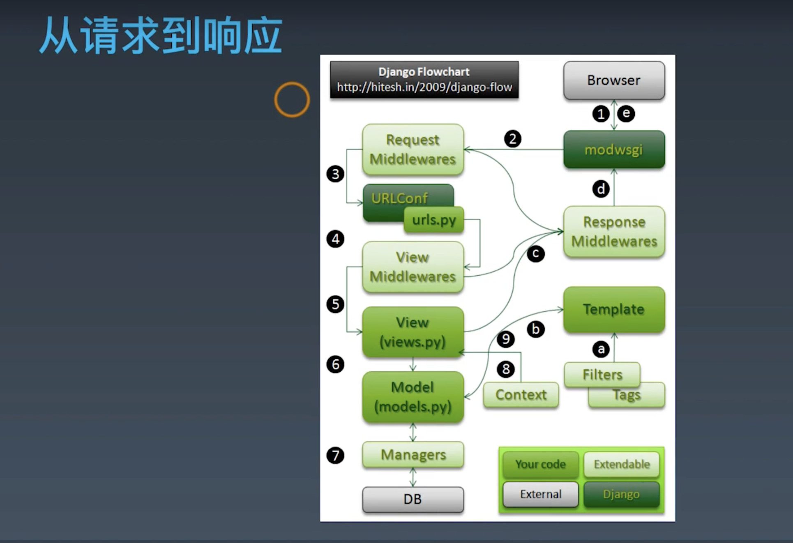

## 一、Django 源码分析指 URLconf 的偏函数
1. 偏函数 partial
```
# 官方文档 demo
# from functools import partial
# basetwo = partial(int, base=2)
# basetwo.__doc__ = 'Convert base 2 string to an int.'
# basetwo('10010')
# 18
```
   - 注意：
      - 1. partial 第一个参数必须是可调用对象
      - 2. 参数传递顺序是从左到右，但不能超过原函数参数个数
      - 3. 关键字参数会覆盖 partial 中定义好的参数
2. django 处理请求流程

## 二、DjangoWeb 相关功能
1. Django 管理界面
   - 创建管理员账号：python manage.py createsuperuser
   - 增加模型：./index/admin.py（index 是一个 app）
   - 注册模型
```
from .models import Type,Name
# 注册模型
admin.site.register(Type)
admin.site.register(Name)
```
2. settings 文件解释
```
"""
Django settings for MyDjango project.

Generated by 'django-admin startproject' using Django 2.2.13.

For more information on this file, see
https://docs.djangoproject.com/en/2.2/topics/settings/

For the full list of settings and their values, see
https://docs.djangoproject.com/en/2.2/ref/settings/
"""

import os

#### 项目路径
# Build paths inside the project like this: os.path.join(BASE_DIR, ...)
BASE_DIR = os.path.dirname(os.path.dirname(os.path.abspath(__file__)))

#### 密钥
# Quick-start development settings - unsuitable for production
# See https://docs.djangoproject.com/en/2.2/howto/deployment/checklist/

# SECURITY WARNING: keep the secret key used in production secret!
SECRET_KEY = 'p*d7^ue2xmk+1d(5!jk_1^lk2r1jf%!+@)k3!)hjo3(c%mygsu'

#### 调试模式
# SECURITY WARNING: don't run with debug turned on in production!
DEBUG = True

#### 域名访问权限
ALLOWED_HOSTS = []

#### App列表
# Application definition

INSTALLED_APPS = [
    ####  内置的后台管理系统
    'django.contrib.admin',
    ####  内置的用户认证系统
    'django.contrib.auth',
    #### 所有model元数据
    'django.contrib.contenttypes',
    #### 会话，表示当前访问网站的用户身份
    'django.contrib.sessions',
    #### 消息提示
    'django.contrib.messages',
    #### 静态资源路径
    'django.contrib.staticfiles',
    #### 注册自己的APP
    'index',
    'Douban'
]
#### 中间件是request和response对象之间的钩子
MIDDLEWARE = [
    'django.middleware.security.SecurityMiddleware',
    'django.contrib.sessions.middleware.SessionMiddleware',
    'django.middleware.common.CommonMiddleware',
    'django.middleware.csrf.CsrfViewMiddleware',
    'django.contrib.auth.middleware.AuthenticationMiddleware',
    'django.contrib.messages.middleware.MessageMiddleware',
    'django.middleware.clickjacking.XFrameOptionsMiddleware',
    'index.middleware.Middle1'
]

ROOT_URLCONF = 'MyDjango.urls'

TEMPLATES = [
    {
        #### 定义模板引擎
        'BACKEND': 'django.template.backends.django.DjangoTemplates',
        #### 设置模板路径
        'DIRS': [],
        #### 是否在App里查找模板文件
        'APP_DIRS': True,
        #### 用于RequestContext上下文的调用函数
        'OPTIONS': {
            'context_processors': [
                'django.template.context_processors.debug',
                'django.template.context_processors.request',
                'django.contrib.auth.context_processors.auth',
                'django.contrib.messages.context_processors.messages',
            ],
        },
    },
]

WSGI_APPLICATION = 'MyDjango.wsgi.application'

# Database
# https://docs.djangoproject.com/en/2.2/ref/settings/#databases
#### 数据库配置，默认是sqlite，Django2.2使用mysqlclient或pymysql模块连接MySQL
# DATABASES = {
#     'default': {
#         'ENGINE': 'django.db.backends.sqlite3',
#         'NAME': os.path.join(BASE_DIR, 'db.sqlite3'),
#     }
# }

# export PATH=$PATH:/usr/local/mysql/bin
# OSError: mysql_config not found
# pip install mysqlclient
# pip install pymysql
DATABASES = {
    'default': {
        'ENGINE': 'django.db.backends.mysql',
        'NAME': 'db1',
        'USER': 'root',
        'PASSWORD': 'rootroot',
        'HOST': '127.0.0.1',
        'PORT': '3306',
    }
    # 生产环境有可能连接第二个数据库
    # 'db2': {
    #     'ENGINE': 'django.db.backends.mysql',
    #     'NAME': 'mydatabase',
    #     'USER': 'mydatabaseuser',
    #     'PASSWORD': 'mypassword',
    #     'HOST': '127.0.0.1',
    #     'PORT': '3307',
    # }
}

# Password validation
# https://docs.djangoproject.com/en/2.2/ref/settings/#auth-password-validators

AUTH_PASSWORD_VALIDATORS = [
    {
        'NAME': 'django.contrib.auth.password_validation.UserAttributeSimilarityValidator',
    },
    {
        'NAME': 'django.contrib.auth.password_validation.MinimumLengthValidator',
    },
    {
        'NAME': 'django.contrib.auth.password_validation.CommonPasswordValidator',
    },
    {
        'NAME': 'django.contrib.auth.password_validation.NumericPasswordValidator',
    },
]

# Internationalization
# https://docs.djangoproject.com/en/2.2/topics/i18n/

LANGUAGE_CODE = 'en-us'

TIME_ZONE = 'UTC'

USE_I18N = True

USE_L10N = True

USE_TZ = True

# Static files (CSS, JavaScript, Images)
# https://docs.djangoproject.com/en/2.2/howto/static-files/

STATIC_URL = '/static/'
```
## 三、DjangoWeb 相关功能-表单
1. 表单
```
<from action="result.html" method="post">
  username:<input type="text" name="username" /><br>
  password:<input type="password" name="password" /><br>
  <input type="submit" value="登录">
</form>
```
2. 使用 form 对象定义表单
```
# form.py
from django import forms
class LoginForm(froms.From)
    username = forms.CharField()
    password = forms.CharField(widget=forms.PasswordInput, min_length=6)
```
```
# views.py
from .form import LoginForm
from django.contrib.auth import authenticate, login
def login2(request):
    if request.method == 'POST':
        login_form = LoginForm(request.POST)
        if login_form.is_valid():
            # 读取表单的返回值
            cd = login_form.cleaned_data 
            user = authenticate(username=cd['username'], password=cd['password'])
            if user:
                # 登陆用户
                login(request, user)  
                return HttpResponse('登录成功')
            else:
                return HttpResponse('登录失败')
    # GET
    if request.method == "GET":
        login_form = LoginForm()
        return render(request, 'form2.html', {'form': login_form})
```
```
# forms.py
from django import forms

class LoginForm(forms.Form):
    username = forms.CharField()
    password = forms.CharField(widget=forms.PasswordInput, min_length=6)
```
```
<! from2.html>
<!DOCTYPE html>
<html lang="en">
<head>
    <meta charset="UTF-8">
    <title>Title</title>
</head>
<body>
<p>Input your username and password</p>
<form action="/login2" method="post">
    
    {{ form }}
    <input type="submit" value="Login">
</form>
</body>
</html>
```
## 四、表单 CSRF 防护
1. csrf 防护
```
# settings.py 中的 csrf 注释，@csrf_protect 单独防护某一个函数请，如果 settings.py 中的 csrf 打开，@csrf_exempt 免除某个请求防护

from django.views.decorators.csrf import csrf_exempt, csrf_protect
@csrf_exempt
def result(request):
    return render(request, 'result.html')

# receiver
def my_callback1(sender, **kwargs):
    print("Request started!")
  
# connect
from django.core.signals import request_started
request_started.connect(my_callback1)

from django.core.signals import request_finished
from django.dispatch import receiver

@receiver(request_finished)
def my_callback2(sender, **kwargs):
    print("Request finished!")
```
## 五、用户认证系统
1. auth 功能
```
# views.py
from .form import LoginForm
from django.contrib.auth import authenticate, login
def login2(request):
    if request.method == 'POST':
        login_form = LoginForm(request.POST)
        if login_form.is_valid():
            # 读取表单的返回值
            cd = login_form.cleaned_data 
            user = authenticate(username=cd['username'], password=cd['password'])
            if user:
                # 登陆用户
                login(request, user)  
                return HttpResponse('登录成功')
            else:
                return HttpResponse('登录失败')
```