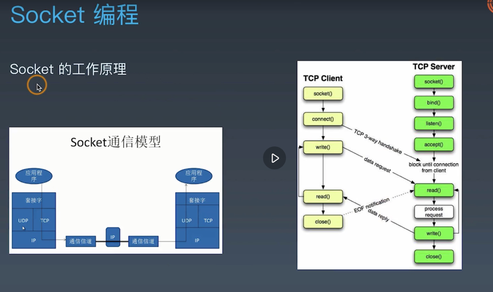

## 一、socket 通信协议
1. 
2. http、dns、ftp 都是基于 socket 通信的
3. socket api:
   - socket()
   - bind()
   - listen()
   - accept()
   - recv()
   - send()
   - close()
```
# socket 客户端
import socket

# socket.AF_INET 参数表示使用 IPV4，socket.SOCK_STREAM 参数表示使用 TCP 协议连接
s = socket.socket(socket.AF_INET, socket.SOCK_STREAM)

# debug
print(f"s1 : {s}")

s.connect(('www.httpbin.org', 80))

# debug
print(f"s2 : {s}")

s.send(b'GET / HTTP/1.1\r\nHOST:time.geekbang.org\r\nConnection: close\n\r\n')

buffer = []

while True:
    data = s.recv(1024)
    if data:
        buffer.append(data)
    else:
        break
s.close()

response = b''.join(buffer)

header, html = response.split(b'\r\n\r\n', 1)

print(header.decode('utf-8'))

with open('index.html', 'wb') as f:
    f.write(html)
```
```
# Echo Server 客户端
import socket

HOST = 'localhost'
PORT = 10000

def echo_client():
    ''' Echo Server 的 client 端'''
    s = socket.socket(socket.AF_INET, socket.SOCK_STREAM)
    s.connect((HOST, PORT))

    while True:
        # 接收用户输入数据并发送服务端
        data = input('input>')

        # 设定退出条件
        if data == 'exit':
            break
        
        # 发送数据到服务端
        s.sendall(data.encode())

        # 接收服务端数据
        data = s.recv(1024)
        
        if not data:
            break
        else:
            print(data.decode('utf-8'))
    s.close()

if __name__ == '__main__':
    echo_client()
```
```
# Echo Server 服务端
import socket

HOST = 'localhost'
PORt = '10000'

def echo_server():
    '''Echo Server 的 Server 端'''
    s = socket.socket(socket.AF_INET, socket.SOCK_STREAM)

    # 对象 s 板顶到指定的主机和端口上
    s.bind((HOST, PORT))

    # 只接受 1 个连接
    s.listen(1)

    while True:
        # accept 表示接受用户端的连接
        conn, addr = s.accept()
        
        # 输出客户端地址
        print(f'Connected by {addr}')

        while True:
            data = conn.recv(1024)
            if not data:
                break
            conn.sendall(data)
        conn.close()
    s.close()

if __name__ == '__main__':
    echo_server()
```