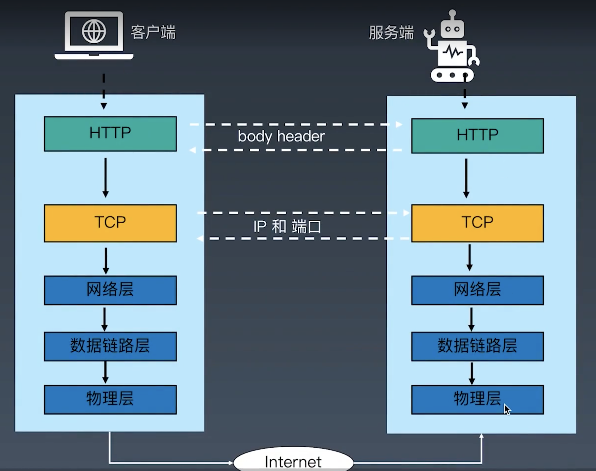

## 一、socket 通信协议
1. 
2. http、dns、ftp 都是基于 socket 通信的
3. socket api:
   - socket()
   - bind()
   - listen()
   - accept()
   - recv()
   - send()
   - close()
```
# socket 客户端
import socket

# socket.AF_INET 参数表示使用 IPV4，socket.SOCK_STREAM 参数表示使用 TCP 协议连接
s = socket.socket(socket.AF_INET, socket.SOCK_STREAM)

# debug
print(f"s1 : {s}")

s.connect(('www.httpbin.org', 80))

# debug
print(f"s2 : {s}")

s.send(b'GET / HTTP/1.1\r\nHOST:time.geekbang.org\r\nConnection: close\n\r\n')

buffer = []

while True:
    data = s.recv(1024)
    if data:
        buffer.append(data)
    else:
        break
s.close()

response = b''.join(buffer)

header, html = response.split(b'\r\n\r\n', 1)

print(header.decode('utf-8'))

with open('index.html', 'wb') as f:
    f.write(html)
```
```
# Echo Server 客户端
import socket

HOST = 'localhost'
PORT = 10000

def echo_client():
    ''' Echo Server 的 client 端'''
    s = socket.socket(socket.AF_INET, socket.SOCK_STREAM)
    s.connect((HOST, PORT))

    while True:
        # 接收用户输入数据并发送服务端
        data = input('input>')

        # 设定退出条件
        if data == 'exit':
            break
        
        # 发送数据到服务端
        s.sendall(data.encode())

        # 接收服务端数据
        data = s.recv(1024)
        
        if not data:
            break
        else:
            print(data.decode('utf-8'))
    s.close()

if __name__ == '__main__':
    echo_client()
```
```
# Echo Server 服务端
import socket

HOST = 'localhost'
PORt = '10000'

def echo_server():
    '''Echo Server 的 Server 端'''
    s = socket.socket(socket.AF_INET, socket.SOCK_STREAM)

    # 对象 s 板顶到指定的主机和端口上
    s.bind((HOST, PORT))

    # 只接受 1 个连接
    s.listen(1)

    while True:
        # accept 表示接受用户端的连接
        conn, addr = s.accept()
        
        # 输出客户端地址
        print(f'Connected by {addr}')

        while True:
            data = conn.recv(1024)
            if not data:
                break
            conn.sendall(data)
        conn.close()
    s.close()

if __name__ == '__main__':
    echo_server()
```
## 二、前端基础
1. 
## 三、捕获异常
1. 自定义异常
```
class UserInputError(Exception):
    def __init__(self, ErrorInfo):
        super().__init__(self, ErrorInfo)
        self.errorinfo = ErrorInfo
    
    def __str__(self):
        return self.errorinfo

userinput = 'a'

try:
    if (not userinput.isdigt()):
        raise UserInputError('用户输入错误')
except UserInputError as ue:
    print('ue')
finally:
    del userinput
```
2. 美化异常的第三方包：pretty_errors
3. 文件读取异常
```
class Open:
    def __enter__(self):
        print("open")

    def __exit__(self, type, value, trace):
        print("close")
    
    def __call__(self):
        pass

with Open() as f:
    pass
# 上下文协议
```
4. 深入了解 http 协议
   - requests.get 带参请求
```
import requests

payload = {'key1':'value1', 'key2':['value2', 'value3']}

r = requests.get('http://xxx.com', params=payload)

r.url
```
```
import requests

r = requests.get('http://github.com')
# 返回码
r.status_code
# header 头
r.headers['content-type']
# 编码
r.encoding
# 页面内容
r.text
```
5. 深入了解 POST 方式和 cookie
   - http 协议的 post 方法
```
import requests
r = requests.post('http://httpbin.org/post', data={'key':'value'})
# 返回结果 json 化
r.json()
```
   - session & cookie
```
import requests

# 在同一个 Session 实例发出的所有请求之间保持 cookie
s = requests.Session()

s.get('http://httpbin.org/cookies/set/sessioncookie/123456789')
r = s.get('http://httpbin.org/cookies')

print(r.text)

# 会话可以使用上下文管理器
with requests.Session() as s:
    s.get('http://httpbin.org/cookies/set/sessioncookie/123456789')
```
    - 模拟登陆代码示例
```
import time
import requests
from fake_useragent import UserAgent

ua = UserAgent(verify_ssl=False)
headers = {
    'UserAgent': ua.random,
    'Referer': 'https://accounts.douban.com/passport/login?source=movie'
}

# 会话对象，在同一个 Session 示例发出的所有请求之间保持 cookie
# 期间使用 urllib3 的 connection pooling 功能
# 向同一主机发送多个请求，底层的 TCP 链接将会被重用，从而带来显著的性能提升
s = requests.Session()

# 链接通过“检查”中的 Request URL 获取
login_url = 'https://accounts.douban.com/j/mobile/login/basic'

# 格式通过“检查”中的 From_data 获取
form_data = {
    'ck':'',
    'name':'123456@qq.com',
    'password':'123456',
    'remember':'false',
    'ticket':''
}

response = s.post(login_url, data = form_data, headers = headers)

# 登录后可进行后续的请求
# url2 = 'https://accounts.doubam.com/passport/setting'

# response2 = s.get(url2, headers = headers)
# response3 = newsession.get(url3, headers = headers, cookies = s.cookies)

# with open('profile.html', 'w+') as f:
#     f.write(response2.text)
```
## 四、使用 XPath 匹配网页内容&实现翻页功能
1. 翻页的处理
```
import requests
from lxml import etree
from time import sleep

def get_url_name(url):
    ua = 'Mozilla/5.0 (Macintosh; Intel Mac OS X 11_2_0) AppleWebKit/537.36 (KHTML, like Gecko) Chrome/88.0.4324.96 Safari/537.36'
    header = {'user-agent':ua}
    response = requests.get(url, headers=header)

    selector = etree.HTML(response.text)

    # 电影名称列表
    '''
    //div 表示精确查找，@class='hd' (注意引号) 表示这个属性的 div 标签，/a/ 表示 div 下的 a 标签，span[1] 表示第一个元素
    '''
    film_name = selector.xpath('//div[@class="hd"]/a/span[1]/text()')

    # 电影链接列表
    film_link = selector.xpath('//div[@classs="hd"]/a/@href')

    # 遍历对应关系字典
    film_info = dict(zip(film_name, film_link))

    for i in film_info:
        print(f'电影名称：{i} 的链接是：{film_info[i]}')

if __name__ == '__main__':
    # 生成包含所有页面的元组
    urls = tuple(f'https://movie.douban.com/top250?start={ page * 25}&filter=' for page in range(1,10))

    for url in urls:
        get_url_name(url)
        sleep(5)
```
## 五、模拟 Scrapy 拆分爬虫搜索
```
import json
import requests
import threading
from lxml import etree
from queue import Queue

class CrawlThread(threading.Thread):
    def __init__(self, thread_id, queue):
        super().__init__()
        self.thread_id = threading
        self.queue = queue
        self.headers = {
            'User-Agent': 'Mozilla/5.0 (Macintosh; Intel Mac OS X 11_2_0) AppleWebKit/537.36 (KHTML, like Gecko) Chrome/88.0.4324.96 Safari/537.36'
        }

    def run(self):
        # 重写 run 方法
        print(f'启动线程：{self.thread_id}')
        self.scheduler()
        print(f'结束线程：{self.thread_id}')
    
    # 模拟调度任务
    def scheduler(self):
        # 队列为空不处理
        while not self.queue.empty():
            page = self.queue.get()
            print(f'下载线程：{self.thread_id}, 下载页面：{page}')
            url = f'https://book.douban.com/top250?start={page*25}'

            try:
                # downloader 下载器
                response = requests.get(url, headers=self.headers)
                dataQueue.put(response.text)
            except Exception as e:
                print('下载出现异常', e)

class ParserThread(threading.Thread):
    def __init__(self, thread_id, queue, file):
        threading.Thread.__init__(self)
        self.thread_id = thread_id
        self.queue = queue
        self.file = file

    def run(self):
        print(f'启动线程：{self.thread_id}')
        while flag:
            try:
                item = self.queue.get(False)
                # 参数为 false 时队列为空，抛出异常
                if not item:
                    continue
                self.parse_data(item)
                self.queue.task_done()
                # get 之后检测是否会阻塞
            except Exception as e:
                pass
        print(f'结束线程: {self.thread_id}')
    
    def parse_data(self, item):
        try:
            html = etree.HTML(item)
            books = html.xpath('//div[@class="pl2"]')
            for book in books:
                try:
                    title = book.xpath('./a/text()')
                    link = book.xpath('./a/@href')
                    response = {
                        'title': title,
                        'link': link
                    }
                    # 解析方法和 scrapy 相同，在构造一个 json
                    json.dump(response, fp=self.file, ensure_ascii=False)
                except Exception as e:
                    print('book error', e)
        except Exception as e:
            print('page_error', e)

def going_on():
    # 定义存放网页的任务队列
    pageQueue = Queue(20)
    for page in range(0,11):
        pageQueue.put(page)

    # 定义存在解析数据的任务队列
    dataQueue = Queue()

    # 多线程
    crawl_threads = []
    crawl_name_list = ['crawl_1', 'crawl_2', 'crawl_3']
    for thread_id in crawl_name_list:
        thread = CrawlThread(thread_id, pageQueue)
        thread.start()
        crawl_threads.append(thread)
    
    # 将结果保存到一个 json 文件中
    with open('book.json', 'a', encoding='utf-8') as pipline_f:
        # 解析线程
        parse_thread = []
        parser_name_list = ['parse_1', 'parse_2', 'parse_3']
        flag = True
        for thread_id in parser_name_list:
            thread = ParserThread(thread_id, dataQueue, pipline_f)
            thread.start()
            parse_thread.append(thread)

        # 结束 crawl 线程
        for t in crawl_threads:
            t.join()

        # 结束 parse 线程
        flag = False
        for t in parse_thread:
            t.join()

    print('退出主线程')

if __name__ == '__main__':
    going_on()
```